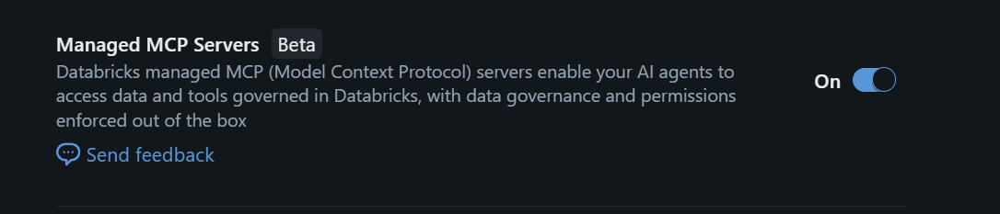

# f1databricks
## Databricks Notebooks
This repository contains the following notebooks on how to transform the [kaggle - Formula 1 Race Data](https://www.kaggle.com/datasets/jtrotman/formula-1-race-data/data) csv data through the medallion architecture to chat with your data in a Databricks Genie Space.
- [Silver - All Tables](src/Silver%20-%20All%20Tables.ipynb): This notebook takes .csv files from Kaggle that are uploaded to the bronze volume and transforms them into delta tables in the Silver catalog.  There are two variable to update in the notebook to point to the information for your environment.

    1. bronze_file_path - Set this to match your bronze volume path.
    2. silver_catalog_schema - Set this to match your CATALOG.SCHEMA for your silver environment.

- [Gold - All Tables](src/Gold%20-%20All%20Tables.ipynb) : This notebook transforms all the tables into the Silver catalog to delta tables that act as materialized views in the Gold catalog.  There are two variable to update in the notebook to point to the information for your environment.

    1. silver_catalog_schema - Set this to match your CATALOG.SCHEMA for your silver environment.
    2. gold_catalog_schema - Set this to match your CATALOG.SCHEMA for your silver environment.

You can clone this repo to your GitHUb environment and add this to your Databricks environment via Git Folders. For more on this topic, check out [Set up Databricks Git folders](https://learn.microsoft.com/en-us/azure/databricks/repos/repos-setup).

## Genie Spaces
You can create a Databricks Genie space to chat with your gold data.  Check out [Set up and manage an AI/BI Genie space](https://learn.microsoft.com/en-us/azure/databricks/genie/set-up) for more information on how to setup an Azure Databricks Genie Space.

You can enhance your instructions with example below.
```
Task interpretation rules:

When the user asks who won the race or who finished on the podium, use the "results" table. The winners are defined as the drivers with position 1, 2, or 3.

    Use this SQL pattern:

        SELECT driver, position, constructorName
        FROM catadb360dev.f1gold.results
        WHERE race = {{race}}
        AND year = {{year}}
        AND positionOrder IN (1, 2, 3)
        ORDER BY positionOrder;

    If the user does not specify a race, ask for clarification.

    Output Rules:

    Always sort results by position ascending.
    Present the answer as a list:
    1st place
    2nd place
    3rd place


When the user asks about constructor standings, use the "constructor_standings" table.  

    Use this SQL pattern:

        select constructor as constructorName, position, points,race, date
        from catadb360dev.f1gold.constructor_standings
        where year = {{year}}
        and date = (select max(date) from catadb360dev.f1gold.constructor_standings where year = {{year}})
        group by date, constructorStandingsId, points, position, wins, race, year, constructor
        order by position 

    If the user does not specify a year, ask for clarification.

    Output Rules:

    Always sort results by position ascending.
    Present the answer as a list.

When the user asks about drivers with the most wins in a certain year.

    Use this SQL pattern:

        SELECT
            driver,
            date,
            wins
        FROM
            catadb360dev.f1gold.driver_standings
        WHERE
            year = {{year}}
            AND wins > 0
            AND date = (SELECT max(date) FROM catadb360dev.f1gold.driver_standings WHERE year = 2025)
        GROUP BY
            driver,
            date,
            wins
        ORDER BY
            wins DESC;

     If the user does not specify a year, ask for clarification.

Date Range Rule:
When I ask for data for the last X years, always include the current year in the range. For example, if today is in 2025 and I ask for the last 20 years, return data from 2006 through 2025 inclusive, not just completed years.
```

## AI Foundry and Copilot Studio using an Azure Databricks MCP Server
You can also integrate this Genie Space with both Azure AI Foundry and Copilot Studio.  For more on this topic check out  [Azure Databricks Genie integration with Copilot Studio and Microsoft Foundry is now live!](https://azurefeeds.com/2025/11/19/azure-databricks-genie-integration-with-copilot-studio-and-microsoft-foundry-is-now-live/)

There is one setting you have to turn on at the workspace level in Databricks under Previews, otherwise you get cryptic error messages in Copilot Studio and AI Foundry.



For more on this topic, check out [Model Context Protocol (MCP) on Databricks](https://learn.microsoft.com/en-us/azure/databricks/generative-ai/mcp/).


## AI Foundry and Copilot Studio calling the Genie space directly
For Copilot Studio, an alternative approach to utilizing the MCP Server would be to call the Genie space directly via an Agent that utilizes a Power Automate Cloud Flow as a tool.  For more on this topic check out my [CopilotGenieAgent](https://github.com/jcbendernh/CopilotGenieAgent) GitHub repo.

For Azure AI Foundry, an alternative approach to utilizing the MCP Server would be to call the Genie space directly via an Agent.  This is constructed within Visual Studio Code instead of the User Interface in Azure AI Foundry. For more on this topic check out my [AIFoundryGenie](https://github.com/jcbendernh/AIFoundryGenie) GitHub repo.
